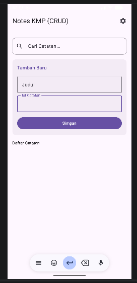
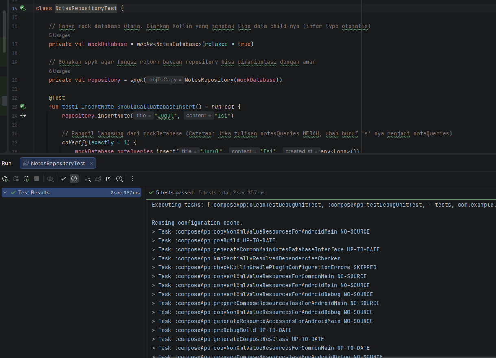
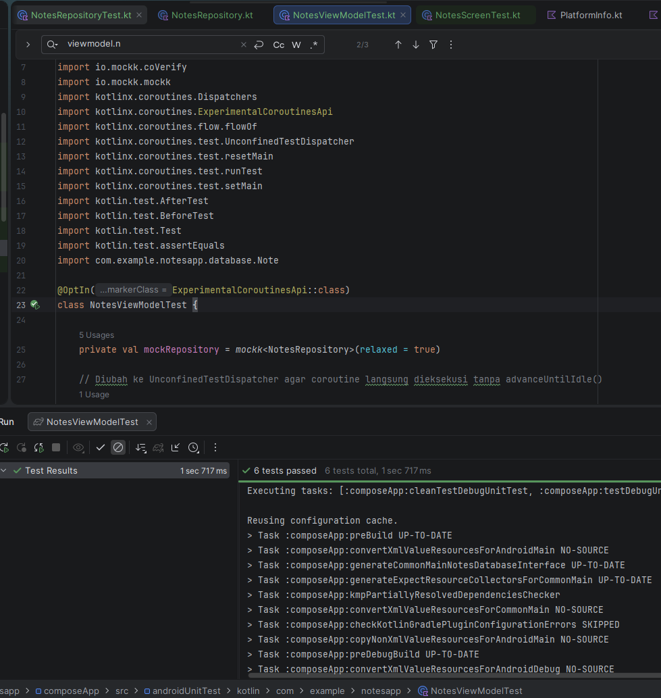
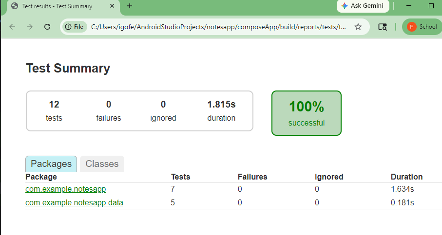

# NotesApp - Kotlin Multiplatform (KMP) Practicum

Repository ini berisi proyek **NotesApp** yang dibangun menggunakan **Kotlin Multiplatform (KMP)** dan **Compose Multiplatform**. Proyek ini dirancang sebagai pemenuhan tugas praktikum pengembangan aplikasi mobile modern dengan menerapkan Arsitektur MVVM, Dependency Injection (DI), Asynchronous Flow, serta pengujian perangkat lunak yang komprehensif (Unit Testing, Flow Testing, dan UI Testing).

---

## Fitur Utama
- **Manajemen Catatan (Notes Management)**: Menambah, melihat, dan menghapus catatan secara lokal.
- **Arsitektur Clean & Reusable**: Memisahkan logika bisnis (*Business Logic*), repositori data, dan antarmuka (UI) agar kode dapat digunakan kembali di berbagai platform (Android/iOS).
- **Integrasi Gemini Service**: Fitur berbasis AI menggunakan `GeminiService` dengan manajemen jaringan terpusat via `HttpClient` dan `NetworkMonitor`.

---

## Stack Teknologi & Library
- **Core**: Kotlin Multiplatform (KMP)
- **UI Framework**: Compose Multiplatform / Jetpack Compose
- **Dependency Injection**: Koin Core & Koin Android
- **Concurrency & Asynchronous**: Kotlin Coroutines & Asynchronous Flow
- **Testing Framework**:
  - JUnit 4 & Kotlin Test
  - **MockK**: Untuk melakukan mocking pada layer Repository.
  - **Turbine**: Library khusus untuk menguji alur data (`Flow` dan `StateFlow`).
  - **Compose UI Test**: Untuk pengujian fungsionalitas komponen antarmuka Android.

---

## Arsitektur Proyek
Aplikasi ini menerapkan pola arsitektur **MVVM (Model-View-ViewModel)** dengan struktur sebagai berikut:

1. **View (UI Layer)**: `NotesScreen.kt` yang menampilkan visualisasi data catatan dan menangkap interaksi pengguna.
2. **ViewModel**: `NotesViewModel.kt` yang mengelola state UI (`notes`) berbasis `StateFlow` dan menjembatani aksi UI ke layer data.
3. **Repository**: `NotesRepository.kt` yang mengabstraksi sumber data (Database/Network).
4. **Model/Entity**: `Note.kt` sebagai skema representasi data catatan.

---

## Manajemen Dependency Injection (Koin)

Konfigurasi DI diatur di dalam `AppModule.kt`. Seluruh komponen didaftarkan agar pembuatan objek otomatis ditangani oleh Koin menggunakan pola resolusi ketergantungan yang tepat:

```kotlin
val appModule = module {
    // 1. Mendaftarkan HTTP Client untuk keperluan network/AI
    single { HttpClient() }

    // 2. GeminiService membutuhkan HttpClient, di-inject menggunakan get()
    single { GeminiService(client = get()) }

    // 3. NetworkMonitor didaftarkan menggunakan factory agar selalu membuat instance baru
    factory { NetworkMonitor(context = androidContext()) }
}
```
---

## Screenshot







